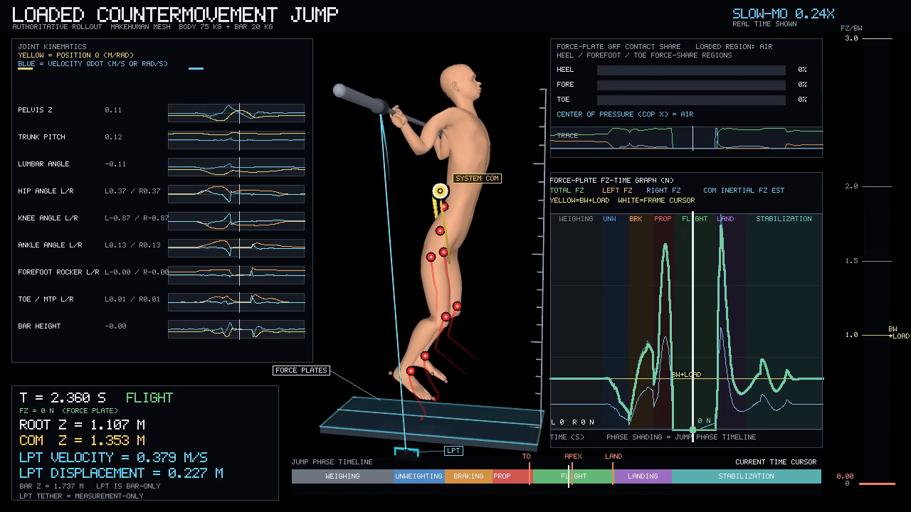

# Loaded CMJ System Identification

> Local release-candidate status: this checkout is complete for owner review,
> but it is not currently hosted as a public repository and has no remote, DOI,
> or release page. Relative links below refer to this local Git checkout.

## Overview

This project is a research-engineering port of a full-morphology
loaded countermovement-jump (CMJ) system. It couples a linked sagittal human
model, an externally loaded bar, bilateral force plates, and a bar-mounted
linear-position transducer (LPT) measurement model in MuJoCo.

The source XML and plant implementation are retained as the scientific
authority. The public modules provide ordinary parameter loading, simulation,
measurement preprocessing, bounded fitting, validation, dataset generation, and
rendering entry points around that plant.

## Demo

The intended presentation output is `media/loaded_cmj_demo.mp4`, with a static
observable comparison in `media/observable_fit.png` when generated locally.
`python examples/plot_observables.py` also writes separated dark-background
figures for force-platform metrics, global/foot/joint kinematics, contact
mechanics, phase timing, and scalar summaries, plus one single-axes combined
figure (`media/combined_grf_com_lpt.png`) for GRFs, COM-z, LPT velocity, and
LPT displacement. That figure uses separate native-unit y-axes so no channel
is normalized or hidden by the force scale.
Those are derived artifacts from the committed source plant; the renderer is
wired to the approved MakeHuman visual asset family, external bar, bilateral
force plates, force/LPT traces, event markers, phase labels, and mechanics
diagnostics.

[](media/loaded_cmj_demo.mp4)

- [Open the rendered MP4](media/loaded_cmj_demo.mp4)
- [Open the combined native-unit GRF/COM/LPT plot](media/combined_grf_com_lpt.png)
- [Open the observable fit plot](media/observable_fit.png)
- [Read the visualization contract](docs/visualization.md)

## Research question

The synthetic experiment asks how well bounded parameter fitting can recover a
loaded-CMJ plant from public force-platform and bar/LPT observations. It is a
reproducible system-identification demonstration, not an experimental human
validation study or a subject-specific digital twin.

## Modeled loaded countermovement jump

The plant retains the linked torso, pelvis, bilateral hip/knee/ankle chains,
articulated hindfoot/forefoot/toe segments, hand-to-bar grip constraints, bar
rack, external load, ground contacts, and force-plate contact pairs. The
simulation uses the source timestep and solver settings and drives the six
leg torque actuators with the source phase-aware controller.

## Measurements

The primary observed channels are bilateral vertical force-platform signals,
their total/net force transforms, bar displacement, and bar velocity. The LPT
channel is explicitly the displacement of the loaded bar at the LPT site; it is
not a center-of-mass displacement measurement. Filtering, delay, scaling,
offset, the 100 Hz comparison grid, and the weighing/event rules are retained
in `configs/preprocessing.json` and `src/loaded_cmj/plant.py`.

The measurement definitions and units are documented in
[`docs/measurements.md`](docs/measurements.md). In particular, a channel named
`bar_displacement_m` remains bar displacement throughout simulation,
preprocessing, fitting, validation, and plotting.

## Parameterization

`configs/param_schema.json` is the single parameter authority. It defines the
full 27-scalar vector, including body mass, joint stiffness/damping, phase
gains, actuator delay, rack/grip/contact compliance, force-platform bias/scale,
encoder behavior, bar attachment offset, and LPT tether terms. The nominal,
example, public reference-fit, and synthetic-reference configurations are in
`configs/`.

## Synthetic experiment generation

The deterministic generator in [tools/generate_dataset.py](tools/generate_dataset.py)
uses the same 2 ms MuJoCo plant, resamples to the source 100 Hz grid, and adds
the declared observation noise. Use a scratch directory for regeneration:

```bash
python tools/generate_dataset.py --output-dir /tmp/loaded-cmj-generated
```

The checked-in identification and validation trials are ordinary public
fixtures. `configs/synthetic_reference.json` documents the parameter vector
used to generate the synthetic reference observations.

## Mechanics-first system identification

The public fitting path is:

```text
observations -> source preprocessing -> bounded parameter vector
             -> full MuJoCo forward simulation -> force/bar observables
             -> residual diagnostics -> fitted structured parameters
```

The optimizer varies explicitly named coordinates and always returns the full
structured parameter object. `src/loaded_cmj/validation.py` reports force,
bar/LPT, event, summary, contact, and finite-state diagnostics without reducing
them to a single normalized grade.

## Reproduce the results

```bash
python -m pip install -e ".[dev]"
pytest
python examples/simulate.py
python examples/identify.py
python examples/validate.py
python examples/plot_observables.py
python examples/render.py
```

Rendering requires an `ffmpeg` executable and a MuJoCo OpenGL backend. The
renderer writes 1280×720 H.264 MP4 output at 30 fps by default.

For the complete fresh-environment procedure, expected qualification evidence,
and the optional source-vs-target audit, see
[`docs/reproducibility.md`](docs/reproducibility.md). The checked-in example
identification and validation scripts intentionally use small trial/evaluation
budgets so they remain quick executable examples; the library APIs support the
full public splits.

## Rendering and scientific visualization

`src/loaded_cmj/rendering.py` captures the live post-step MuJoCo state and
composes the MakeHuman body, bar, plate, LPT device/tether, exact COM marker,
bilateral force traces, bar/LPT trace, phase strip, event markers, joint
kinematics, and metric panels. The plotting example keeps kinetics separate
from kinematics, except for the explicitly combined force-plate/bar-LPT
measurement figure. All figures use the source-defined CMJ phase timing as
translucent background bands. The MakeHuman scene is render-only: it is posed
from live plant landmarks but is never stepped for physics.

## Repository structure

- `src/loaded_cmj/`: public wrappers and the directly ported plant/renderer.
- `assets/`: authoritative MJCF and MakeHuman visual assets.
- `configs/`: parameter schema, preprocessing, and reproducible configurations.
- `data/`: public identification and validation observations.
- `tools/`: deterministic dataset and equivalence utilities.
- `tests/`: plant integrity, mechanics, preprocessing, dataset, and validation checks.
- `docs/`: methodology, mechanics, measurement, identification, validation,
  API, visualization, provenance, reproducibility, and release notes.

The most useful starting points are:

- [`docs/methodology.md`](docs/methodology.md): scientific workflow and source
  preprocessing contract;
- [`docs/mechanics.md`](docs/mechanics.md): plant topology, contacts, actuators,
  and model integrity;
- [`docs/api.md`](docs/api.md): programmatic entry points and data flow;
- [`docs/visualization.md`](docs/visualization.md): phase shading, channel
  semantics, figure set, and renderer behavior;
- [`docs/reproducibility.md`](docs/reproducibility.md): fresh-environment and
  source-equivalence qualification;
- [`docs/provenance.md`](docs/provenance.md): direct-port and visual-asset
  provenance;
- [`docs/release-checklist.md`](docs/release-checklist.md): owner actions needed
  once a hosted repository exists.

## Limitations

This is a synthetic research system. It does not establish experimental human
validity, subject-specific physiological inference, or muscle-level physiology.
The identified parameters have meaning within this MuJoCo plant and its
measurement model.

## Asset provenance and license

Original code is released under Apache-2.0. The MakeHuman asset family keeps
its CC0 notice and provenance records in
`assets/makehuman_cmj_visual/`; those records apply to the visual asset family
and are separate from the code license.

The citation file intentionally contains no repository URL or DOI because no
hosted repository or archival record exists yet. Replace the accountable author
metadata and add those identifiers only when they are real; see
[`CITATION.cff`](CITATION.cff) and the
[`local release checklist`](docs/release-checklist.md).

## References

- MuJoCo documentation: <https://mujoco.readthedocs.io/>
- MakeHuman community licensing information:
  <https://static.makehumancommunity.org/makehuman/docs/licensing.html>
