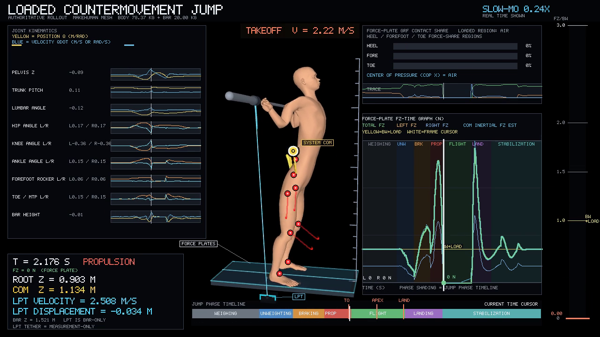

# Loaded CMJ System Identification

> Local release-candidate status: this checkout is complete for owner review,
> but it is not currently hosted as a public repository and has no remote, DOI,
> or release page. Relative links below refer to this local Git checkout.

## Overview

Loaded CMJ System Identification in MuJoCo is a deterministic,
mechanics-first system-identification study of a modeled loaded countermovement
jump under a fixed 20 kg external load, using bilateral force-platform
measurements and bar/LPT kinematics. It couples the source-authoritative linked
sagittal rigid-body model, externally loaded bar, bilateral force plates, and
bar-mounted linear-position transducer (LPT) measurement model in MuJoCo.

The source XML and plant implementation are retained as the scientific
authority. The public modules provide ordinary parameter loading, simulation,
measurement preprocessing, bounded fitting, validation, dataset generation, and
rendering entry points around that plant.

No external publication is presented as the numerical source of the plant or
its parameters. The public citation-to-code boundary is maintained in the
[`reference map`](docs/reference_map.md), with the citation-only bibliography
in [`docs/references.bib`](docs/references.bib).

## Media suite

The authoritative presentation outputs are scenario-centric: each frozen
public trial has one directory containing its production 1280×720 MakeHuman
render, preview, complete static plot family, and render provenance. The
machine-readable index is [`media/MANIFEST.json`](media/MANIFEST.json).

[](media/20kg_nominal_a/render.mp4)

Nominal A is the representative hero because it shows the fixed-load experiment
without emphasizing a perturbation. The same production renderer and native-
unit analysis are available for every qualified condition:

| Scenario | Condition | Media bundle |
| --- | --- | --- |
| Nominal A | reference | [`20kg_nominal_a/`](media/20kg_nominal_a/) |
| Nominal B | independent measurement realization | [`20kg_nominal_b/`](media/20kg_nominal_b/) |
| Depth | countermovement-depth perturbation | [`20kg_depth/`](media/20kg_depth/) |
| Timing | phase-timing perturbation | [`20kg_timing/`](media/20kg_timing/) |
| Depth + Timing | combined same-load perturbation | [`20kg_depth_timing/`](media/20kg_depth_timing/) |
| Bilateral asymmetry | synthetic inter-limb drive excitation | [`20kg_bilateral_asymmetry/`](media/20kg_bilateral_asymmetry/) |

Cross-scenario figures are in [`media/comparison/`](media/comparison/). The
combined GRF/COM/LPT figure keeps force, COM, and bar/LPT channels in their
native units using synchronized panels; the LPT channels remain bar
measurements, not COM measurements. Read the [visualization contract](docs/visualization.md)
for the semantic plot grammar and render-lineage details.

## Public experiment

The release fixes every identification and validation trial at
`external_load_kg = 20.0`. The six public identification conditions are:

- `20kg_nominal_a` and `20kg_nominal_b`: identical mechanics with independent
  deterministic measurement realizations;
- `20kg_depth`: the validated countermovement-depth perturbation;
- `20kg_timing`: the validated phase-timing perturbation;
- `20kg_depth_timing`: the minimal same-load depth/timing combination; and
- `20kg_bilateral_asymmetry`: a qualified synthetic inter-limb drive excitation.

The final condition is a known experiment-layer excitation, not a clinical
model, diagnosis, dominance estimate, or fitted identification coordinate.
The project is a reproducible system-identification demonstration, not an
experimental human-validation study or a subject-specific digital twin.

## Modeled loaded countermovement jump

The plant retains the linked torso, pelvis, bilateral hip/knee/ankle chains,
articulated hindfoot/forefoot/toe segments, hand-to-bar grip constraints, bar
rack, external load, ground contacts, and force-plate contact pairs. The
simulation uses the source timestep and solver settings and drives the six
leg torque actuators with the source phase-aware controller.

## Measurements

The primary observed channels are left and right vertical force-platform
signals, their exact bilateral total/net force transforms, bar displacement,
and bar velocity. The LPT
channel is explicitly the displacement of the loaded bar at the LPT site; it is
not a center-of-mass displacement measurement. Filtering, delay, scaling,
offset, the 100 Hz comparison grid, and the weighing/event rules are retained
in `configs/preprocessing.json` and `src/loaded_cmj/plant.py`.

The measurement definitions and units are documented in
[`docs/measurements.md`](docs/measurements.md). In particular, a channel named
`bar_displacement_m` remains bar displacement throughout simulation,
preprocessing, fitting, validation, and plotting.

## Parameterization

`configs/param_schema.json` is the single parameter authority. It defines the
full 27-scalar vector, including body mass, joint stiffness/damping, phase
gains, actuator delay, rack/grip/contact compliance, force-platform bias/scale,
encoder behavior, bar attachment offset, and LPT tether terms. The nominal,
example, public reference-fit, and synthetic-reference configurations are in
`configs/`.

## Synthetic experiment generation

The deterministic generator in [tools/generate_dataset.py](tools/generate_dataset.py)
uses the same 2 ms MuJoCo plant, resamples to the source 100 Hz grid, and adds
the declared observation noise. Use a scratch directory for regeneration:

```bash
LCMJ_DATASET_OUTPUT_DIR="$(mktemp -d)"
python tools/generate_dataset.py --output-dir "$LCMJ_DATASET_OUTPUT_DIR"
```

The checked-in identification and validation trials are ordinary public
fixtures, all at 20 kg. `configs/synthetic_reference.json` documents the
source-authoritative synthetic reference parameter vector used to generate the
observations.

## Mechanics-first system identification

The public fitting path is:

```text
observations -> source preprocessing -> bounded parameter vector
             -> full MuJoCo forward simulation -> force/bar observables
             -> residual diagnostics -> fitted structured parameters
```

The optimizer varies explicitly named coordinates and always returns the full
structured parameter object. `src/loaded_cmj/validation.py` reports force,
bar/LPT, event, summary, contact, and finite-state diagnostics without reducing
them to a single normalized grade.

## Reproduce the results

```bash
python -m pip install -e ".[dev]"
python -m pytest
python examples/simulate.py
python examples/identify.py
python examples/validate.py
python examples/generate_media_suite.py --reuse-renders
```

Media generation requires an `ffmpeg` executable and a MuJoCo OpenGL backend.
It writes one 1280×720 H.264 MP4 at 30 fps for each qualified public scenario.

For the complete fresh-environment procedure, expected qualification evidence,
and the optional source-vs-target audit, see
[`docs/reproducibility.md`](docs/reproducibility.md). The checked-in example
identification and validation scripts intentionally use small trial/evaluation
budgets so they remain quick executable examples; the library APIs support the
full public splits.

## Rendering and scientific visualization

`src/loaded_cmj/rendering.py` captures the live post-step MuJoCo state and
composes the MakeHuman body, bar, plate, LPT device/tether, exact COM marker,
bilateral force traces, bar/LPT trace, phase strip, event markers, joint
kinematics, and metric panels. `examples/plot_observables.py` uses a fixed
semantic palette, model/observed marker grammar, side line styles, synchronized
native-unit panels, a lower-limb small-multiple matrix, and a six-lane contact
raster. The MakeHuman scene is render-only: it is posed from live plant
landmarks but is never stepped for physics.

## Repository structure

- `src/loaded_cmj/`: public wrappers and the directly ported plant/renderer.
- `assets/`: authoritative MJCF and MakeHuman visual assets.
- `configs/`: parameter schema, preprocessing, and reproducible configurations.
- `data/`: public identification and validation observations.
- `tools/`: deterministic dataset and equivalence utilities.
- `tests/`: plant integrity, mechanics, preprocessing, dataset, and validation checks.
- `docs/`: methodology, mechanics, measurement, identification, validation,
  API, visualization, provenance, reproducibility, and release notes.

The most useful starting points are:

- [`docs/methodology.md`](docs/methodology.md): scientific workflow and source
  preprocessing contract;
- [`docs/mechanics.md`](docs/mechanics.md): plant topology, contacts, actuators,
  and model integrity;
- [`docs/api.md`](docs/api.md): programmatic entry points and data flow;
- [`docs/visualization.md`](docs/visualization.md): phase shading, channel
  semantics, figure set, and renderer behavior;
- [`docs/reproducibility.md`](docs/reproducibility.md): fresh-environment and
  source-equivalence qualification;
- [`docs/provenance.md`](docs/provenance.md): direct-port and visual-asset
  provenance;
- [`docs/reference_map.md`](docs/reference_map.md): citation roles and
  implementation traceability;
- [`docs/release-checklist.md`](docs/release-checklist.md): owner actions needed
  once a hosted repository exists.

## Limitations

This is a synthetic research system. It does not establish experimental human
validity, subject-specific physiological inference, or muscle-level physiology.
The identified parameters have meaning within this MuJoCo plant and its
measurement model.

This release does not perform force-velocity profiling.

## Asset provenance and license

Original code is released under Apache-2.0. The MakeHuman asset family keeps
its CC0 notice and provenance records in
`assets/makehuman_cmj_visual/`; those records apply to the visual asset family
and are separate from the code license.

The MakeHuman visual source is acknowledged and cited even though the official
MakeHuman asset guidance describes the core/exported asset pathway as CC0.
See [`docs/provenance.md`](docs/provenance.md) and
[`docs/references.bib`](docs/references.bib) for the recommended software/asset
acknowledgment and the modelling-framework publication.
The official asset-pack catalog distinguishes CC0 and CC-BY packs; the local
inventory is an owner-exported core body/eye texture, not a downloaded
community pack.

The citation file intentionally contains no repository URL or DOI because no
hosted repository or archival record exists yet. Replace the accountable author
metadata and add those identifiers only when they are real; see
[`CITATION.cff`](CITATION.cff) and the
[`local release checklist`](docs/release-checklist.md).

## References

The complete citation-only bibliography, role classifications, implementation
locations, and evidence boundary are in
[`docs/reference_map.md`](docs/reference_map.md) and
[`docs/references.bib`](docs/references.bib). The canonical software and asset
acknowledgments are MuJoCo ([Todorov et al.](https://doi.org/10.1109/IROS.2012.6386109)),
NumPy ([Harris et al.](https://doi.org/10.1038/s41586-020-2649-2)), SciPy
([Virtanen et al.](https://doi.org/10.1038/s41592-019-0686-2)), Matplotlib
([Hunter](https://doi.org/10.1109/MCSE.2007.55)), and the [MakeHuman Community
license guidance](https://static.makehumancommunity.org/about/license.html).
